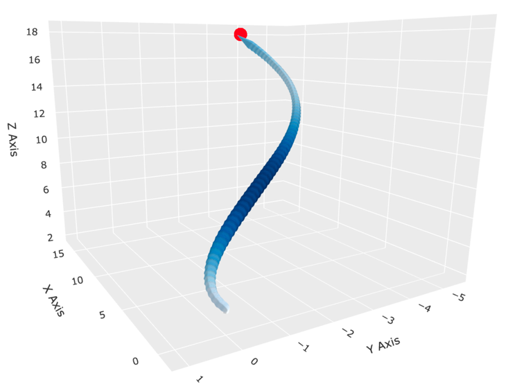
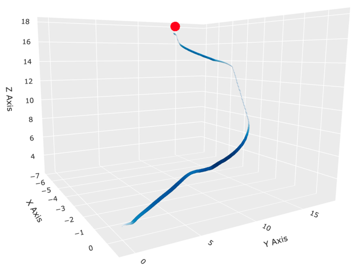
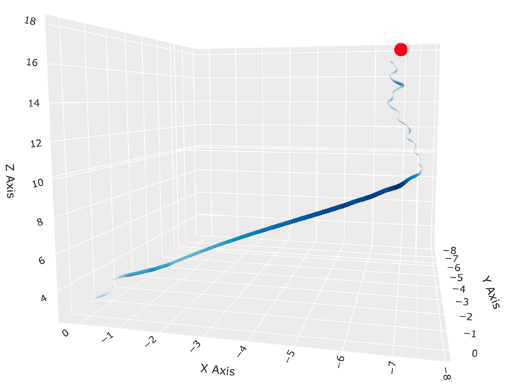
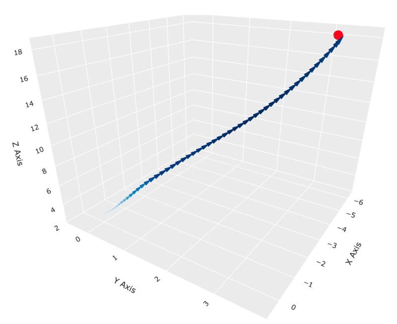
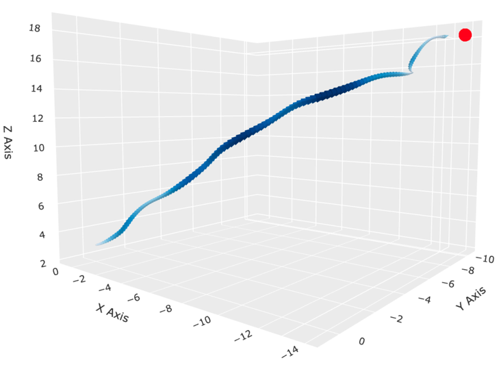
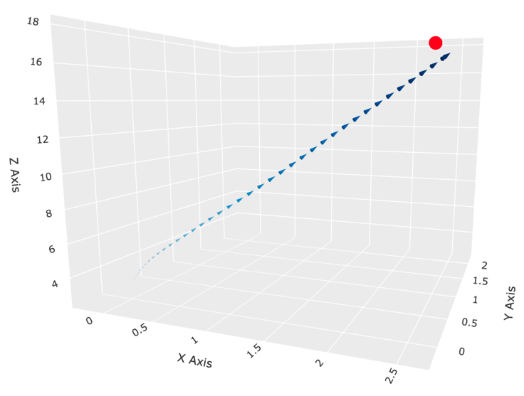

# RLNav - Reinforcement Learning for UAV Waypoint Navigation

*A Reinforcement Learning Approach for UAV Waypoint Navigation*

## Overview

This repository contains all the code concerning my research on **UAV waypoint navigation**
using reinforcement learning (RL). The project explores the **convergence behavior** of various RL algorithms
within a **tailored simulation environment based on PyFlyt**. The primary focus is on **stabilizing training dynamics**,
**optimizing hyperparameters**, **comparing command designs** and **refining the state-space** as well as the **reward function** for
improved UAV control.

## Project Scope

The objective of this project is to apply **Proximal Policy Optimization (PPO)**, **Soft Actor-Critic (SAC)**, and **Deep Deterministic Policy Gradient (DDPG)** for UAV waypoint navigation in a simulated environment. The work builds on insights from my bachelor thesis:

> *Analysis of Various Reinforcement Learning Algorithms for Unmanned Aerial Vehicle Waypoint Navigation Approaches*\
> [Technische Hochschule Ingolstadt, 2025]

## Features

- **Custom PyFlyt Gymnasium Environment**: Extended state and action spaces, including angular positional data and reward function refinements.
- **Reinforcement Learning Algorithms**: Adaptation of PPO, SAC, and DDPG for UAV control from stable-baselines3.
- **Hyperparameter Optimization**: Fine-tuned learning rates, entropy coefficients, and discount factors.
- **Policy Analysis**: Analysis of stability, overall efficiency, and success rate of all policies.

## Repository Structure

```
pyflyt_experience/
 ├── agent_inference/          # containts a script for running inference on the models 
 ├── checkpoints/          # Contains the model checkpoints saved during training
 ├── docs/          # Contains my finalised bachelor thesis
 ├── Envs/     # Contains the custom PyFlyt Gymnasium environment and Reward function
 ├── Evaluation/     # Contains scripts and notebooks for evaluation of the trained models
 ├── VisualsBA/           # Contains the scripts and plots for the visualizations of the results (used in my thesis)
 ├── logs/          # Contains the tensorboard logs for the training of the models
 ├── models/           # Pre-trained RL models, for angular and thrust control
 ├── pics/           # Contains the images of the trajectories used in the README
 ├── requirements/          # Contains two requirements files, one for devices with CUDA and one for devices without CUDA support
 ├── train/          # Contains the training scripts for the RL models as well as the tensorboard logs for hyperparameter optimization
 ├── README.md         # This document
```

## Visualisation of trajectories

| Control Type     | PPO                               | SAC                               | DDPG                                |
|------------------|-----------------------------------|-----------------------------------|-------------------------------------|
| **Angular Control** |  |  |  |
| **Thrust Control**  |   |   |   |


For a more detailed view of the produced trajectories, refer to the [VisualsBA](VisualsBA) directory. It contains, among other figures, interactive plots, 
providing one with the chance of freely investigating the results.

## Results

Experiments indicate that **PPO outperforms SAC and DDPG** in terms of navigating
**efficiently** towards waypoints. **SAC does however outperform PPO and DDPG** in terms of **consistency**, achieving a higher overall
success rate.
Results further suggest that controlling the UAV via **angular position is generally
more efficient** and target-orientated than using thrust control.
**DDPG** is found to be the **least effective** algorithm, with the lowest success rate and highly
inefficient navigation control compared to PPO and SAC.

For a more in-depth analysis of the results, please refer to my [thesis](docs/Bachelorthesis_Felix,Unterleiter.pdf).

# Getting started

## Installation

```bash
# Clone the repository
git clone https://github.com/felix-basiliskroko/RLNav.git
cd RLNav

# Create a virtual environment (is optional but recommended)
python -m venv rl_venv
source rl_venv/bin/activate  # On Windows use: venv\Scripts\activate

# Install dependencies
cd requirements
pip install -r requirements_cuda.txt  # For devices with CUDA support
pip install -r requirements.txt  # For devices without CUDA support
```

## Usage

### Train a model

```bash
python3 main.py --algorithm="ppo" --total_steps=500000 --eval_freq=20000 \
                --hyperparam_mode="tuned" --flight_mode=1 --run_name="TestRun"
```

For a more detailed overview of the training process, refer to the [train](train/README.md) directory.

### Run inference

```bash
cd agent_inference
python3 main.py --algorithm="SAC" --control="angular"
```

Can additionally be passed the '--render' flag to render the UAV's in real-time. If ommited, the evaluation will be done without rendering
and prints the UAVs position, distance to target and current time in seconds into the command line.

Please note that if the '--render' flag is passed, the effectiveness of the policy is not guaranteed as the UAV will not be aligned with the target
before starting. This can lead to the UAV crashing into the ground or not reaching the target at all. 

## Key Insights

- **Observation Space Design**: The addition of angular velocity data enhances UAV stability.
- **Action Space**: Controlling the UAV via angular positions is generally more effective than thrust control across all algorithms
- **Training Dynamics**: Learning rate annealing does not indicate to significantly improve effectiveness.

## License

This project is licensed under the MIT License. See [`LICENSE`](LICENSE) for details.

## Acknowledgments

- **Technische Hochschule Ingolstadt**, specifically Konstantin Bake 
 and Professor Doctor Christian Seidel for their continuous academic support.
- **Airbus Defence and Space** for their supporting me as part of my dual study
program.
- **The [PyFlyt](https://github.com/jjshoots/PyFlyt) Developers** for providing an extensible UAV simulation environment.


## Contact

Felix Unterleiter\
[GitHub Profile](https://github.com/felix-basiliskroko)\
[LinkedIn](https://your-linkedin.com)

---
© 2025 Felix Unterleiter. All rights reserved.

